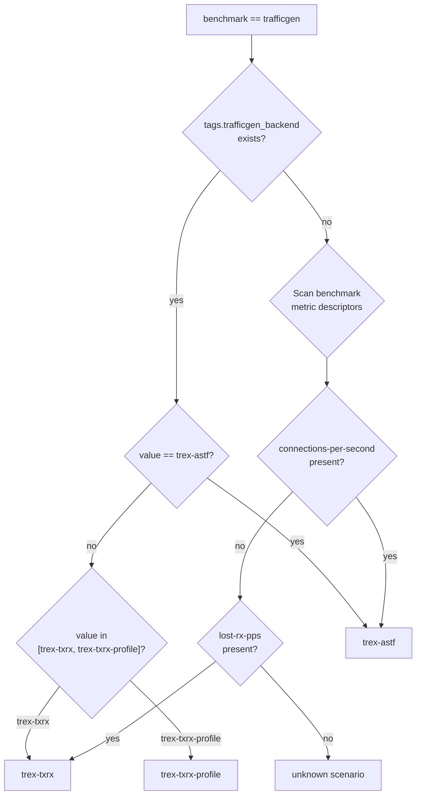
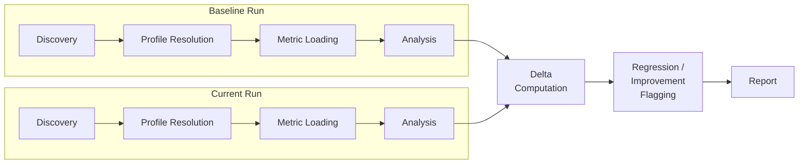

# Architecture

Technical architecture for crucible-run-analysis: a profile-driven benchmark run analysis engine for the [crucible](https://github.com/perftool-incubator/crucible) performance testing framework.

## 1. Overview

crucible-run-analysis reads CommonDataModel (CDM) metric data from `/var/lib/crucible/run/` directories, applies configurable YAML analysis profiles, and produces structured reports. It operates as two components:

- **Engine** (`bin/analyze-run.py`) -- a self-contained Python script that implements the full analysis pipeline
- **Plugin** (`plugins/crucible-analysis/`) -- a Claude plugin with a thin SKILL.md that invokes the engine and displays output verbatim

The engine requires only Python 3.6+ and PyYAML. It runs on the host outside any container.

## 2. End-to-End Data Flow

### Invocation Path


### Engine Pipeline

```mermaid
flowchart TD
    D["Phase 1: Discovery"]
    PR["Phase 2: Profile Resolution"]
    ML["Phase 3: Metric Loading"]
    A["Phase 4: Analysis"]
    C["Phase 5: Compare"]
    O["Phase 6: Output"]

    D -->|"benchmark, tags, tools, scenario, datapath"| PR
    PR -->|"merged profile YAML"| ML
    ML -->|"metric descriptors + time-series values"| A
    A -->|"primary metrics, correlations, patterns, recommendations"| C
    C -->|"delta percentages, regressions, improvements"| O
    O -->|"markdown | json | summary"| Result["Report"]

    style D fill:#2d4a22,stroke:#4a7a33
    style PR fill:#2d4a22,stroke:#4a7a33
    style ML fill:#2d4a22,stroke:#4a7a33
    style A fill:#2d4a22,stroke:#4a7a33
    style C fill:#2d3a5e,stroke:#4a6a9e
    style O fill:#4a3a22,stroke:#7a5a33
```



Phase 5 (Compare) is only active when `--compare-dir` is supplied. Single-run analysis skips directly from Phase 4 to Phase 6.

## 3. Phase 1: Discovery

Discovery extracts run metadata from the directory structure and configuration files.

### 3.1 Run Directory Parsing

The run directory basename follows the pattern:

```
BENCHMARK--TIMESTAMP--UUID
```

Example: `trafficgen--2026-06-05_06:37:33_UTC--8ab97461-5b1b-45bf-a0b6-ac0d0b99e8ba`

The engine splits on `--` to extract:
- `benchmark`: the benchmark name (e.g., `trafficgen`, `fio`, `iperf`)
- `timestamp`: ISO-ish timestamp with underscores (e.g., `2026-06-05_06:37:33_UTC`)
- `uuid`: run identifier (e.g., `8ab97461-5b1b-45bf-a0b6-ac0d0b99e8ba`)

### 3.2 Configuration Loading

Two files from `config/` provide the run's parameters:

| File | Content |
|------|---------|
| `config/run-file.json` | Full run specification: benchmark params, endpoints, tags |
| `config/tool-params.json` | Array of tool entries with optional params |

Tags are extracted from `run-file.json` under the top-level `tags` object:

```json
{
    "tags": {
        "scenario": "ovsdpdk-astf-short-lived-tcp-no-conntrack",
        "trafficgen_backend": "trex-astf",
        "protocol": "tcp",
        "connection_type": "short-lived"
    }
}
```

The tool list is extracted from `config/tool-params.json`:

```json
[
    { "tool": "sysstat" },
    { "tool": "procstat" },
    { "tool": "ovs", "params": [{ "arg": "interval", "val": "10" }] },
    { "tool": "dpdk", "params": [{ "arg": "interval", "val": "1" }, { "arg": "profile", "val": "testpmd" }] }
]
```

### 3.3 Scenario Auto-Detection (trafficgen)

For the `trafficgen` benchmark, the engine determines the TRex mode using a two-tier detection strategy:



The tag-based path reads `trafficgen_backend` from `run-file.json` tags. The fallback path scans benchmark metric descriptors for characteristic metric types:

| Mode | Characteristic Metric |
|------|----------------------|
| `trex-astf` | `connections-per-second` |
| `trex-txrx` / `trex-txrx-profile` | `lost-rx-pps` |

Profiler data (source `trafficgen-trex-profiler`) is only present in `trex-txrx-profile` mode. Its presence or absence distinguishes `trex-txrx` from `trex-txrx-profile` when the tag value does not differentiate them.

### 3.4 Datapath Detection

The datapath is determined by tool presence in `config/tool-params.json`:

| Condition | Datapath |
|-----------|----------|
| `ovs` in tool list | OVS-DPDK |
| `ovs` absent from tool list | SR-IOV |

## 4. Phase 2: Profile Resolution

### 4.1 Resolution Priority

The engine resolves which profile YAML to load using the following priority chain:

```
--profiles-dir (user absolute path)
    > --profile NAME (explicit override)
        > auto-detection (based on benchmark + scenario + datapath)
            > _base.yaml (fallback)
```

1. **`--profiles-dir DIR`**: User supplies an absolute path to a directory of custom profiles. The engine searches this directory instead of the built-in `profiles/` tree.
2. **`--profile NAME`**: User supplies an explicit profile name (e.g., `astf-ovsdpdk`). The engine loads `profiles/BENCHMARK/NAME.yaml` directly, skipping auto-detection.
3. **Auto-detection**: The engine constructs a profile name from the scenario and datapath discovered in Phase 1. For trafficgen, this yields names like `astf-ovsdpdk`, `astf-sriov`, `stl-ovsdpdk`, `stl-sriov`.
4. **`_base.yaml` fallback**: If no benchmark-specific profile matches, the engine falls back to `profiles/_base.yaml`, which defines universal system metrics only.

### 4.2 Profile Merge

When a benchmark-specific profile is found, it is merged with `_base.yaml`:

| Section | Merge Strategy |
|---------|---------------|
| `tool_correlations` | Concatenated (base entries + benchmark entries) |
| `profiler_correlations` | Concatenated (base entries + benchmark entries) |
| `patterns` | Concatenated (base entries + benchmark entries) |
| `primary_metrics` | Replaced (benchmark profile wins entirely) |
| `match` | Not merged (only present in benchmark profiles) |

The merge ensures that every analysis includes base system metrics (CPU, memory, interrupts) alongside benchmark-specific correlations.

## 5. Phase 3: Metric Loading

### 5.1 Metric Source Categories

The engine loads metrics from four categories of CDM data:

| Category | Path Pattern | Example |
|----------|-------------|---------|
| Benchmark measurement | `run/iterations/iteration-N/sample-N/ROLE/ID/metric-data-trial-N.*` | `iteration-1/sample-1/client/1/metric-data-trial-1.json.xz` |
| TRex profiler | `run/iterations/iteration-N/sample-N/profiler/ID/metric-data-*.*` | (only in trex-txrx-profile mode) |
| Tool instances | `run/tool-data/ROLE/INSTANCE/TOOL/metric-data-FILEID.*` | `profiler/remotehosts-1-dpdk-1/dpdk/metric-data-0.json` |
| Tool file_id mapping | Same as above, with file_id suffix in filename | `sysstat/metric-data-mpstat-0.json`, `ovs/metric-data-ovs-pmd.json` |

### 5.2 CDM File Format

Each metric data set consists of a paired JSON descriptor and CSV time-series file:

**Descriptor** (`metric-data-*.json` or `metric-data-*.json.xz`):

```json
[
    {
        "desc": {
            "class": "throughput",
            "source": "mpstat",
            "type": "Busy-CPU"
        },
        "idx": 0,
        "metric_desc-uuid": "6EDA144C-60AD-11F1-B0E3-525400F46057",
        "names": {
            "core": 0,
            "die": 0,
            "num": 0,
            "package": 0,
            "thread": 0,
            "type": "usr"
        }
    }
]
```

Each descriptor entry contains:
- `desc.source`: originating tool or benchmark post-processor (e.g., `mpstat`, `dpdk`, `trafficgen`)
- `desc.type`: metric type name (e.g., `Busy-CPU`, `rx-packets`, `connections-per-second`)
- `desc.class`: metric classification (`throughput`, `count`)
- `names`: key-value pairs identifying the specific instance (CPU core, NIC port, OVS bridge, etc.)
- `idx`: integer index linking to CSV rows

**Time-series** (`metric-data-*.csv.xz`):

```
idx,begin,end,value
0,1780642042065,1780642043068,45.2
2,1780642042065,1780642043068,3.1
```

Columns: `idx` (links to descriptor), `begin` (epoch ms), `end` (epoch ms), `value` (float).

### 5.3 Tool Instance Paths

Tool data lives under `run/tool-data/` organized by role and instance:

```
run/tool-data/
    profiler/
        remotehosts-1-sysstat-1/sysstat/metric-data-mpstat-0.json
        remotehosts-1-sysstat-1/sysstat/metric-data-mpstat-0.csv.xz
        remotehosts-1-sysstat-1/sysstat/metric-data-sar-net.json
        remotehosts-1-sysstat-1/sysstat/metric-data-sar-net.csv.xz
        remotehosts-1-dpdk-1/dpdk/metric-data-0.json
        remotehosts-1-dpdk-1/dpdk/metric-data-0.csv.xz
        remotehosts-1-ovs-2/ovs/metric-data-ovs-pmd.json
        remotehosts-1-ovs-2/ovs/metric-data-ovs-pmd.csv.xz
        remotehosts-1-procstat-1/procstat/metric-data-0.json
        remotehosts-1-procstat-1/procstat/metric-data-0.csv.xz
```

The instance path segment (`remotehosts-1-sysstat-1`) encodes the endpoint type, endpoint index, tool name, and tool instance number. Tools like sysstat produce multiple file_ids per instance (one per sub-source: `mpstat-0` through `mpstat-N`, `sar-net`, `sar-mem`, `iostat`, etc.).

### 5.4 Caching Strategy

The engine caches loaded metric data keyed by the CSV file path. When the same CSV is referenced by multiple profile entries (e.g., both a `tool_correlations` entry and a `patterns` condition reference `mpstat` data), the CSV is decompressed and parsed only once. The descriptor JSON is always loaded fresh since it is small and fast to parse.

## 6. Phase 4: Analysis

### 6.1 Primary Metrics

The engine extracts primary benchmark KPIs defined in the profile's `primary_metrics` section. For each primary metric:

1. Locate matching descriptors by `source` and `type`
2. Load the corresponding CSV time-series
3. Compute the aggregate value (typically the mean across all samples/trials)
4. Evaluate against the configured threshold (`min` or `max` bound)
5. Flag pass/fail status

### 6.2 Tool Correlations

Each `tool_correlations` entry specifies a tool source, metric type, optional names filter, and an aggregation method. The engine:

1. Finds all matching metric descriptors across tool instances
2. Groups descriptors by their `names` key-value pairs
3. Aggregates values within each group using the configured method:

| Aggregation | Behavior |
|-------------|----------|
| `mean` | Arithmetic mean across all samples in the group |
| `max` | Maximum value across all samples |
| `sum` | Sum of all values in the group |
| `per_instance` | No aggregation; report each instance separately |

4. Reports the aggregated value alongside the profile's expected range or threshold

### 6.3 Dynamic Type Discovery

Some tools produce metric types that are not known at profile authoring time. The engine handles two dynamic discovery patterns:

**ethtool** (`*-sec` types): NIC driver counters are exported with a `-sec` suffix (e.g., `rx_bytes_phy-sec`, `tx_pause_ctrl_phy-sec`). The engine discovers all `desc.type` values matching the glob `*-sec` from ethtool metric descriptors and includes them in analysis without requiring explicit enumeration in the profile.

**dpdk** (`xstat-*` types): DPDK extended statistics are exported with an `xstat-` prefix (e.g., `xstat-rx_good_packets`, `xstat-tx_size_512_to_1023_packets`). The engine discovers all `desc.type` values matching `xstat-*` from dpdk metric descriptors.

Profiles reference these via wildcard type patterns rather than listing every possible counter name.

### 6.4 Pattern Detection

Patterns define composite anomaly conditions that span multiple metrics. Each pattern has:

- A human-readable `name` and `description`
- A list of `conditions`, each referencing a source, type, names filter, and threshold
- An operator: conditions are combined with AND logic

All conditions must evaluate to true for the pattern to fire. When a pattern fires, it is included in the analysis output with its description and the contributing metric values.

### 6.5 Recommendations

The engine generates recommendations based on:

- Failed primary metric thresholds
- Fired patterns
- Tool correlation values outside expected ranges

Recommendations are textual strings defined in the profile, associated with specific metrics or patterns.

## 7. Phase 5: Compare

Compare mode is activated by supplying `--compare-dir` alongside `--run-dir`.

### 7.1 Dual-Run Pipeline

Both runs are independently processed through Phases 1-4:



### 7.2 Delta Computation

For each metric present in both runs, the engine computes:

```
delta_pct = ((current - baseline) / baseline) * 100
```

Where `baseline` is the `--compare-dir` run and `current` is the `--run-dir` run.

### 7.3 Regression/Improvement Flagging

The default threshold is 5%. Metrics are flagged as:

| Condition | Flag |
|-----------|------|
| `delta_pct > +threshold` and higher-is-better | Improvement |
| `delta_pct < -threshold` and higher-is-better | Regression |
| `delta_pct > +threshold` and lower-is-better | Regression |
| `delta_pct < -threshold` and lower-is-better | Improvement |
| `abs(delta_pct) <= threshold` | Unchanged |

The direction (higher-is-better vs. lower-is-better) is determined by the metric's profile entry.

## 8. Phase 6: Output

The engine supports three output formats selected via `--format`:

### 8.1 Markdown (default)

Pre-formatted report with sections for run metadata, primary metrics, tool correlations, fired patterns, and recommendations. Designed for direct consumption by the Claude plugin, which displays the output verbatim to the user.

### 8.2 JSON

Structured data output containing all analysis results as a machine-readable JSON object. Useful for downstream processing, dashboards, or programmatic consumption.

### 8.3 Summary

Single-line output with the run identifier, benchmark name, primary metric values, and overall pass/fail status. Suitable for CI pipelines, log aggregation, or quick status checks.

## 9. Profile Schema (v2)

```yaml
match:
  benchmark: "trafficgen"
  tags:
    trafficgen_backend: "trex-astf"
  tools:
    present: ["ovs"]
    # absent: ["ethtool"]   -- optional exclusion

primary_metrics:
  - source: "trafficgen"
    type: "connections-per-second"
    direction: "higher-is-better"
    threshold:
      min: 1000000
    label: "CPS"
    description: "TCP connections established per second"

  - source: "trafficgen"
    type: "active-flows"
    direction: "lower-is-better"
    threshold:
      max: 5000000
    label: "Active Flows"

tool_correlations:
  - source: "mpstat"
    type: "Busy-CPU"
    names_filter:
      type: ["usr", "sys", "irq", "soft"]
    aggregation: "mean"
    label: "CPU Utilization"

  - source: "dpdk"
    type: "rx-packets"
    aggregation: "sum"
    label: "DPDK RX Packets"

  - source: "ovs-pmd"
    type: "rx-packets"
    names_filter:
      pmd_id: "*"
    aggregation: "per_instance"
    label: "OVS PMD RX"

  - source: "dpdk"
    type: "xstat-*"
    dynamic: true
    aggregation: "sum"
    label: "DPDK Extended Stats"

profiler_correlations:
  - source: "trafficgen-trex-profiler"
    type: "tx-pps"
    aggregation: "mean"
    label: "TRex TX PPS"

  - source: "trafficgen-trex-profiler"
    type: "rx-pps"
    aggregation: "mean"
    label: "TRex RX PPS"

patterns:
  - name: "cpu-saturation"
    description: "CPU cores saturated while benchmark throughput is below threshold"
    conditions:
      - source: "mpstat"
        type: "Busy-CPU"
        names_filter:
          type: ["usr", "sys"]
        aggregation: "max"
        threshold:
          min: 95.0
      - source: "trafficgen"
        type: "connections-per-second"
        threshold:
          max_pct_of_target: 80
    operator: "and"
    recommendation: "CPU is the bottleneck. Consider increasing CPU allocation or enabling CPU pinning."

  - name: "rx-drop-correlation"
    description: "NIC RX drops coincide with high interrupt rate"
    conditions:
      - source: "dpdk"
        type: "rx-missed"
        aggregation: "sum"
        threshold:
          min: 1000
      - source: "interrupts"
        type: "count"
        aggregation: "sum"
        threshold:
          min: 100000
    operator: "and"
    recommendation: "RX packet drops correlate with high interrupt counts. Check NIC ring buffer sizes and IRQ affinity."
```

### Match Block

The `match` block controls auto-detection. It specifies the benchmark name, required tag values, and tool presence/absence constraints. A profile matches when all specified conditions are satisfied.

### Primary Metrics Block

Each entry identifies a benchmark metric by `source` and `type`, declares whether higher or lower values are better, and sets pass/fail thresholds.

### Tool Correlations Block

Each entry identifies a tool metric, optionally filters by `names` key-value pairs, specifies an aggregation method, and provides a human-readable label. The `dynamic: true` flag enables wildcard type discovery.

### Profiler Correlations Block

Identical structure to `tool_correlations` but scoped to profiler-sourced metrics (e.g., TRex profiler time-series). Only populated for modes that produce profiler data.

### Patterns Block

Each pattern defines a named composite condition with AND-combined thresholds across multiple metrics. When all conditions are met, the pattern fires and its `recommendation` is included in the output.

## 10. Future Improvement Roadmap

### 10.1 Planned Benchmark Profiles

| Benchmark | Planned Profiles | Key Primary Metrics |
|-----------|-----------------|-------------------|
| fio | `random-io`, `sequential-io` | IOPS, bandwidth (MB/s), latency (usec) |
| iperf | `tcp-throughput`, `udp-loss` | bits-per-second, jitter, lost-datagrams |
| uperf | `tcp-stream`, `tcp-rr`, `udp-stream` | transactions/s, bytes/s, latency |
| cyclictest | `rt-latency` | max-latency (usec), avg-latency, histogram P99 |
| ilab | `training-throughput` | samples/s, tokens/s, loss |
| pytorch | `inference-latency` | latency (ms), throughput (inferences/s) |
| oslat | `os-jitter` | max-latency (nsec), P99 latency |
| hwnoise | `hw-noise` | max-noise (nsec), noise-frequency |

### 10.2 Extension Guide: Adding a New Benchmark Profile

Adding support for a new benchmark requires six steps:

**Step 1 -- Identify metric types.** Run the benchmark and examine the CDM metric descriptors in `run/iterations/iteration-1/sample-1/*/metric-data-*.json`. Record all `desc.source` and `desc.type` values produced by the benchmark's post-processor.

**Step 2 -- Define primary metrics.** Select the KPIs that represent benchmark success (throughput, latency, error rate). Determine direction (higher/lower-is-better) and acceptable thresholds.

**Step 3 -- Identify tool correlations.** Determine which system metrics (CPU, memory, NIC counters, disk I/O) are relevant to the benchmark's performance characteristics. Reference the tool metric types available from sysstat, procstat, dpdk, ovs, and ethtool.

**Step 4 -- Define patterns.** Identify composite anomaly conditions that cross-correlate tool metrics with benchmark KPIs. Each pattern should have a clear recommendation.

**Step 5 -- Create the profile YAML.** Write the profile to `profiles/BENCHMARK/PROFILENAME.yaml` following the schema in Section 9. Include a `match` block for auto-detection.

**Step 6 -- Test.** Run the engine against a real benchmark run directory:

```bash
python3 bin/analyze-run.py --run-dir /var/lib/crucible/run/BENCHMARK--TIMESTAMP--UUID --profile PROFILENAME
```

Verify that primary metrics are extracted, tool correlations are populated, and patterns fire under the expected conditions.

### 10.3 Tool Coverage Matrix

Current and planned tool coverage across benchmarks:

| Tool | trafficgen | fio | iperf | uperf | cyclictest | oslat |
|------|:----------:|:---:|:-----:|:-----:|:----------:|:-----:|
| sysstat (mpstat) | v1 | planned | planned | planned | planned | planned |
| sysstat (iostat) | v1 | planned | -- | -- | -- | -- |
| sysstat (sar-net) | v1 | -- | planned | planned | -- | -- |
| sysstat (sar-mem) | v1 | planned | -- | -- | planned | planned |
| sysstat (sar-scheduler) | v1 | -- | -- | -- | planned | planned |
| procstat (interrupts) | v1 | planned | planned | planned | planned | planned |
| procstat (softnet) | v1 | -- | planned | planned | -- | -- |
| dpdk | v1 | -- | -- | -- | -- | -- |
| ovs | v1 | -- | -- | -- | -- | -- |
| ethtool | planned | -- | planned | planned | -- | -- |

`v1` = shipped in initial release. `planned` = on the roadmap. `--` = not applicable.
