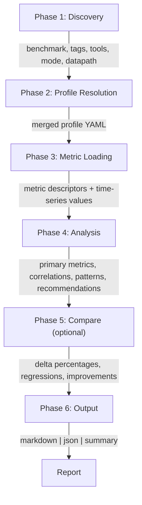
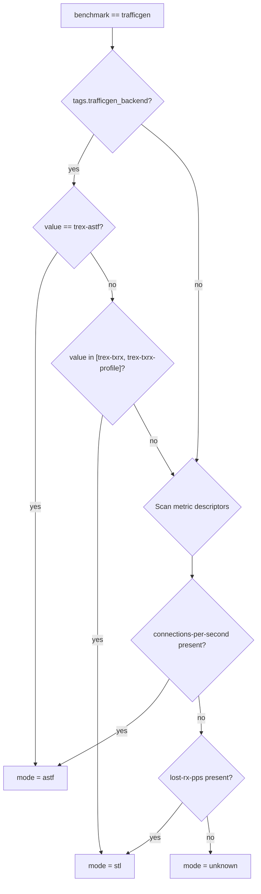
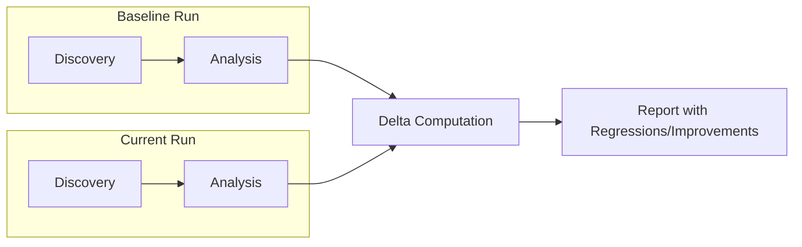

# Architecture

Technical architecture for crucible-run-analysis: a profile-driven benchmark run analysis engine for the [crucible](https://github.com/perftool-incubator/crucible) performance testing framework.

## 1. Overview

crucible-run-analysis reads CommonDataModel (CDM) metric data from `/var/lib/crucible/run/` directories, applies configurable YAML analysis profiles, and produces structured reports. It is designed to be **benchmark-agnostic** -- all benchmark-specific logic lives in profiles, making the engine extensible to any crucible benchmark project.

Components:

- **Engine** (`bin/analyze-run.py`) -- self-contained Python script implementing the full analysis pipeline
- **Plugin** (`plugins/crucible-analysis/`) -- Claude plugin with a thin SKILL.md that invokes the engine and displays output verbatim
- **Profiles** (`profiles/`) -- YAML analysis profiles organized by benchmark, defining metrics, thresholds, correlations, and anomaly patterns

The engine requires only Python 3.6+ and PyYAML. It runs on the host outside any container.

## 2. End-to-End Data Flow

### Invocation Path


### Engine Pipeline



Phase 5 (Compare) is only active when `--compare` is supplied.

## 3. Phase 1: Discovery

### 3.1 Run Directory Parsing

The run directory basename follows the pattern:

```
BENCHMARK--TIMESTAMP--UUID
```

Examples:
- `trafficgen--2026-06-05_06:37:33_UTC--8ab97461-5b1b-45bf-a0b6-ac0d0b99e8ba`
- `fio--2026-07-01_10:00:00_UTC--abc12345-...`
- `iperf--2026-07-02_14:30:00_UTC--def67890-...`

The engine splits on `--` to extract `benchmark`, `timestamp`, and `uuid`.

### 3.2 Configuration Loading

| File | Content |
|------|---------|
| `config/run-file.json` | Full run specification: benchmark params, endpoints, tags |
| `config/tool-params.json` | Array of tool entries with params |

Tags from `run-file.json`:

```json
{
    "tags": {
        "scenario": "ovsdpdk-astf-short-lived-tcp-no-conntrack",
        "trafficgen_backend": "trex-astf",
        "protocol": "tcp",
        "dut": "ovs-dpdk-vm-testpmd-io"
    }
}
```

Tools from `config/tool-params.json`:

```json
[
    { "tool": "sysstat" },
    { "tool": "procstat" },
    { "tool": "ovs", "params": [{ "arg": "interval", "val": "10" }] },
    { "tool": "dpdk", "params": [{ "arg": "interval", "val": "1" }] }
]
```

### 3.3 Scenario Auto-Detection

The engine uses benchmark-specific detection logic based on tags and metric presence.

#### trafficgen Detection



#### Datapath Detection

| Condition | Datapath |
|-----------|----------|
| `ovs` in tool list | OVS-DPDK |
| `ovs` absent from tool list | SR-IOV |

#### vllm Detection

| Profile | Detection Tag | Tool Signals |
|---------|--------------|--------------|
| `cpu-smoke` | `tier=cpu-smoke` | sysstat, procstat |
| `cpu-functional` | `tier=cpu-functional` | sysstat, procstat |
| `gpu-full` | `tier=gpu-full` | sysstat, procstat, nvidia |

#### Future Benchmark Detection

The engine is designed to support additional benchmarks without code changes. Each benchmark's auto-detection is driven entirely by profile `match` rules:

| Benchmark | Expected Detection Tags | Tool Signals |
|-----------|------------------------|--------------|
| **fio** | `workload=randread`, `workload=seqwrite`, etc. | sysstat (iostat critical) |
| **iperf** | `protocol=tcp`, `protocol=udp` | ethtool, procstat |
| **uperf** | `test_type=stream`, `test_type=rr` | ethtool, procstat |
| **cyclictest** | (none -- single mode) | ftrace, kernel |
| **oslat** | (none -- single mode) | ftrace, kernel |
| **ilab** | `model=...`, `batch_size=...` | nvidia |
| **pytorch** | `model=...`, `precision=...` | nvidia |
| **flexran** | `test_case=...` | dpdk |
| **hwnoise** | (none -- single mode) | power |
| **timerlat** | (none -- single mode) | ftrace |
| **hwlatdetect** | (none -- single mode) | kernel |

## 4. Phase 2: Profile Resolution

### 4.1 Resolution Priority

```
--profiles-dir (user absolute path)
    > --profile NAME (explicit override)
        > auto-detection (benchmark + tags + tools)
            > _base.yaml (fallback)
```

### 4.2 Profile Merge

When a benchmark-specific profile is found, it is merged with `_base.yaml`:

| Section | Merge Strategy |
|---------|---------------|
| `tool_correlations` | Concatenated (base + benchmark) |
| `profiler_correlations` | Concatenated (base + benchmark) |
| `patterns` | Concatenated (base + benchmark) |
| `primary_metrics` | Replaced (benchmark profile wins) |
| `match` | Not merged (only in benchmark profiles) |

### 4.3 Profile Directory Structure

```
profiles/
├── _base.yaml                      # Universal (sysstat, procstat) -- all benchmarks
├── trafficgen/                     # v1 -- current
│   ├── astf-ovsdpdk.yaml
│   ├── astf-sriov.yaml
│   ├── stl-ovsdpdk.yaml
│   └── stl-sriov.yaml
├── vllm/                          # v1 -- LLM inference
│   ├── cpu-smoke.yaml
│   ├── cpu-functional.yaml
│   └── gpu-full.yaml
├── fio/                            # Future: block storage
│   ├── random-io.yaml
│   └── sequential-io.yaml
├── iperf/                          # Future: network bandwidth
│   ├── tcp-throughput.yaml
│   └── udp-loss.yaml
├── uperf/                          # Future: network micro-benchmark
│   ├── tcp-stream.yaml
│   ├── tcp-rr.yaml
│   └── udp-stream.yaml
├── cyclictest/                     # Future: RT latency
│   └── realtime-latency.yaml
├── oslat/                          # Future: OS latency
│   └── os-jitter.yaml
├── hwnoise/                        # Future: hardware noise
│   └── platform-noise.yaml
├── ilab/                           # Future: AI training
│   └── training-throughput.yaml
├── pytorch/                        # Future: inference
│   └── inference-latency.yaml
├── flexran/                        # Future: L1 acceleration
│   └── l1-acceleration.yaml
├── timerlat/                       # Future: timer latency
│   └── timer-latency.yaml
└── hwlatdetect/                    # Future: HW latency detection
    └── hw-latency.yaml
```

## 5. Phase 3: Metric Loading

### 5.1 Metric Source Categories

| Category | Path Pattern | Description |
|----------|-------------|-------------|
| Benchmark measurement | `run/iterations/iteration-N/sample-N/ROLE/ID/metric-data-measurement.*` | Primary benchmark KPIs |
| Benchmark trials | `run/iterations/iteration-N/sample-N/ROLE/ID/metric-data-trial-N.*` | Per-trial results |
| Profiler data | `run/iterations/...` (source contains "profiler") | Time-series telemetry (e.g., TRex profiler) |
| Tool instances | `run/tool-data/HOST/INSTANCE/TOOL/metric-data-*.*` | All tool data |

### 5.2 CDM File Format

Each metric data set consists of a paired JSON descriptor and CSV time-series file:

**Descriptor** (`metric-data-*.json`):

```json
[
    {
        "desc": {
            "class": "throughput",
            "source": "trafficgen",
            "type": "connections-per-second"
        },
        "idx": 1,
        "metric_desc-uuid": "7557A622-60AD-11F1-...",
        "names": {}
    }
]
```

Key fields:
- `desc.source`: originating tool or benchmark (e.g., `trafficgen`, `mpstat`, `dpdk`, `ovs-pmd`)
- `desc.type`: metric type name (e.g., `connections-per-second`, `Busy-CPU`, `rx-missed-sec`)
- `desc.class`: classification (`throughput`, `count`, `pass/fail`)
- `names`: instance identifiers (CPU core, NIC port, OVS bridge, etc.)
- `idx`: links to CSV rows

**Time-series** (`metric-data-*.csv.xz`):

```
idx,begin_ms,end_ms,value
1,1780642924044,1780643000795,847706.8125
2,1780642924044,1780643000795,428105
```

### 5.3 Tool Instance Paths

```
run/tool-data/
    profiler/
        remotehosts-1-sysstat-1/sysstat/metric-data-mpstat-0.{json,csv.xz}
        remotehosts-1-sysstat-1/sysstat/metric-data-sar-net.{json,csv.xz}
        remotehosts-1-dpdk-1/dpdk/metric-data-0.{json,csv.xz}
        remotehosts-1-ovs-1/ovs/metric-data-ovs-pmd.{json,csv.xz}
        remotehosts-1-ovs-1/ovs/metric-data-ovs-dpctl.{json,csv.xz}
        remotehosts-1-procstat-1/procstat/metric-data-0.{json,csv.xz}
        remotehosts-1-ethtool-1/ethtool/metric-data-0.{json,csv.xz}
```

Instance segment format: `{role}-{index}-{tool}-{instance_number}`

#### Multi-Instance Tools

Some tools support multiple concurrent instances targeting different processes, configured via the `id` field in `tool-params.json`. For example, `ebpf-dpdk` can profile both OVS and testpmd simultaneously:

```json
[
    { "tool": "ebpf-dpdk", "id": "ebpf-dpdk-ovs", "params": [{ "arg": "target", "val": "ovs-vswitchd" }] },
    { "tool": "ebpf-dpdk", "id": "ebpf-dpdk-testpmd", "params": [{ "arg": "target", "val": "testpmd" }] }
]
```

Multi-instance tools produce directories and metric sources named by `id` rather than the base tool name:

```
run/tool-data/profiler/
    remotehosts-1-ebpf-dpdk-ovs-3/ebpf-dpdk-ovs/metric-data-0.{json,csv.xz}
    remotehosts-1-ebpf-dpdk-testpmd-2/ebpf-dpdk-testpmd/metric-data-0.{json,csv.xz}
```

The engine's `discover_tool_instances()` handles this by first attempting an exact-name match on the inner directory, then falling back to a prefix match (`{tool_name}-*`).

### 5.4 Caching Strategy

CSV data is cached by file path. When multiple profile entries reference the same CSV (e.g., both tool_correlations and patterns referencing `mpstat` data), the CSV is decompressed and parsed only once.

## 6. Phase 4: Analysis

### 6.1 Primary Metrics

For each `primary_metrics` entry in the profile:
1. Find matching descriptors by `source` and `type`
2. Load CSV values for matching indices
3. Compute aggregate (mean across all samples/trials)
4. Evaluate thresholds (`warn_above`, `critical_above`, `warn_below`, `critical_below`)
5. Report value + status

### 6.2 Tool Correlations

Each `tool_correlations` group specifies a tool, condition, source, and metrics list:

1. Check condition (tool present in run)
2. Discover tool instances via glob pattern
3. Load metric descriptors from all instances
4. For each metric definition: find matching descriptors, group by `names` keys, aggregate per group

| Aggregation | Behavior |
|-------------|----------|
| `mean` | Arithmetic mean across all samples |
| `max` | Maximum value |
| `sum` | Sum of all values |
| `per_instance` | Report each names-group separately |

### 6.3 Glob Source Matching and Per-Instance Reporting

Profile `source` and `type` fields support glob patterns (`*`, `?`) via `fnmatch`. This is essential for multi-instance tools where the metric source name includes an instance suffix:

```yaml
tool_correlations:
  - tool: "ebpf-dpdk"
    source: "ebpf-dpdk*"        # matches ebpf-dpdk-ovs, ebpf-dpdk-testpmd, etc.
    condition: "tool_present"
    metrics:
      - type: "top-function-pct"
        label: "PMD Top Function %"
```

When a glob source pattern matches multiple distinct sources, the engine automatically splits results into separate per-source groups. Each actual source (e.g., `ebpf-dpdk-ovs`, `ebpf-dpdk-testpmd`) appears as its own section in the Tool Summary, allowing side-by-side comparison of different profiling targets.

Pattern conditions also support glob source matching:

```yaml
patterns:
  - name: "PMD Hot Function"
    conditions:
      - source: "ebpf-dpdk*"   # fires if any ebpf-dpdk instance has a hot function
        type: "top-function-pct"
        check: "any_above"
        value: 50
```

### 6.4 Dynamic Type Discovery

Some tools produce metric types not known at profile authoring time:

| Tool | Pattern | Example Types |
|------|---------|---------------|
| **ethtool** | `*-sec` | `rx_bytes_phy-sec`, `tx_pause_ctrl_phy-sec`, `queue_restart-sec` |
| **dpdk** | `xstat-*` | `xstat-rx_good_packets`, `xstat-tx_size_512_to_1023_packets` |

Profiles reference these via `dynamic: true` with a wildcard type pattern. The engine discovers all matching types at runtime.

### 6.5 Pattern Detection

Patterns define composite anomaly conditions:

```yaml
patterns:
  - name: "PMD Saturation with Drops"
    severity: "critical"
    conditions:
      - source: "ovs-pmd"
        type: "pmd-busy"
        check: "any_above"
        value: 0.95
      - source: "dpdk"
        type: "rx-missed-sec"
        check: "mean_above"
        value: 0
    recommendation: "Add more PMD cores or reduce offered rate"
```

All conditions use AND logic. Check types: `any_above`, `mean_above`, `sum_above`, `any_below`, `mean_below`, `value_above`.

### 6.6 Recommendations

Generated from:
- Triggered patterns (pattern.recommendation)
- Critical threshold violations (auto-generated)

## 7. Phase 5: Compare

Activated by `--compare PATH`.

### 7.1 Dual-Run Pipeline



### 7.2 Delta Computation

```
delta_pct = ((current - baseline) / baseline) * 100
```

### 7.3 Regression/Improvement Flagging

Default threshold: 5%.

| Condition | Flag |
|-----------|------|
| Throughput metric increased >5% | IMPROVEMENT |
| Throughput metric decreased >5% | REGRESSION |
| Latency/error metric increased >5% | REGRESSION |
| Latency/error metric decreased >5% | IMPROVEMENT |
| Within 5% | OK |

## 8. Phase 6: Output

### 8.1 Markdown (default)

Pre-formatted report with sections: Run Overview, Primary Metrics table, Alerts, Detected Patterns, Tool Summary tables, Comparison (if applicable), Recommendations. Empty sections are omitted.

### 8.2 JSON

Structured JSON object with all analysis results for programmatic consumption.

### 8.3 Summary

Single-line output: `STATUS: benchmark (run-id) metric=value [delta%]`

## 9. Profile Schema (v2)

```yaml
name: "Human-readable Name"
benchmark: "trafficgen"
version: 2
extends: "_base"

match:
  tags:
    trafficgen_backend: "trex-astf"
  tools_present: ["ovs", "dpdk"]
  tools_absent: []

primary_metrics:
  - source: "trafficgen"
    type: "connections-per-second"
    label: "Connections/sec"
    class: "throughput"
    thresholds:
      warn_below: null
      critical_below: null
      warn_above: null
      critical_above: null

tool_correlations:
  - tool: "dpdk"
    source: "dpdk"                  # exact match
    condition: "tool_present"
    metrics:
      - type: "rx-missed-sec"
        label: "DPDK RX Missed/sec"
        aggregation: "sum"
        filter:
          names: ["device"]
        thresholds:
          warn_above: 100
          critical_above: 1000
      - type: "xstat-*"
        label: "DPDK xstat: {type}"
        aggregation: "sum"
        dynamic: true
        thresholds: {}

  - tool: "ebpf-dpdk"
    source: "ebpf-dpdk*"            # glob -- matches ebpf-dpdk-ovs, ebpf-dpdk-testpmd, etc.
    condition: "tool_present"       # each matched source reported as its own section
    metrics:
      - type: "top-function-pct"
        label: "PMD Top Function %"
        aggregation: "max"
        filter:
          names: ["function"]
        thresholds: {}

profiler_correlations:
  - source: "trafficgen-trex-profiler"
    condition: "source_present"
    metrics:
      - type: "per-core-Gbps"
        label: "TRex Per-Core Gbps"
        aggregation: "mean"
        thresholds: {}

patterns:
  - name: "Pattern Name"
    severity: "critical"
    description: "..."
    conditions:
      - source: "source-name"
        type: "metric-type"
        check: "any_above"
        value: 95
    recommendation: "Action to take"
```

## 10. Benchmark-Specific Analysis Design

### 10.1 trafficgen (v1 -- Current)

| Profile | Mode | Datapath | Primary KPI | Key Tool Correlations |
|---------|------|----------|-------------|----------------------|
| `astf-ovsdpdk` | trex-astf | OVS-DPDK | connections-per-second | dpdk, ovs (pmd/dpctl/ofctl/appctl), ethtool, ebpf-dpdk |
| `astf-sriov` | trex-astf | SR-IOV | connections-per-second | dpdk, ethtool, ebpf-dpdk |
| `stl-ovsdpdk` | trex-txrx / trex-txrx-profile | OVS-DPDK | rx-pps | dpdk, ovs, ethtool, ebpf-dpdk + profiler |
| `stl-sriov` | trex-txrx / trex-txrx-profile | SR-IOV | rx-pps | dpdk, ethtool, ebpf-dpdk + profiler |

### 10.2 vllm (v1 -- Current)

| Profile | Tier | Primary KPI | Key Tool Correlations |
|---------|------|-------------|----------------------|
| `cpu-smoke` | cpu-smoke (mock server) | output-tokens-per-sec, TTFT, ITL, E2E latency | sysstat, procstat |
| `cpu-functional` | cpu-functional (real vLLM CPU) | output-tokens-per-sec, TTFT, ITL, E2E latency | sysstat, procstat |
| `gpu-full` | gpu-full (production GPU) | output-tokens-per-sec, TTFT, ITL, E2E latency | nvidia (GPU util, memory, power, SM clock), sysstat, procstat |

15 primary metrics per profile covering throughput (output-tokens/sec, requests/sec, total-tokens/sec) and latency percentiles (TTFT, ITL, E2E at mean/p50/p90/p99).

Patterns to detect:
- Zero throughput (inference pipeline failure)
- GPU memory exhaustion (gpu-full only)
- GPU saturation with latency spike (gpu-full only)
- Thermal throttling (gpu-full only)
- CPU saturation (cpu-functional only)
- Memory pressure during inference (all tiers)

### 10.3 fio (Planned)

| Profile | Workload | Primary KPI | Key Tool Correlations |
|---------|----------|-------------|----------------------|
| `random-io` | 4K random read/write | IOPS | sysstat/iostat (disk util, await, queue depth), kernel (scheduler) |
| `sequential-io` | Large block sequential | Bandwidth (MB/s) | sysstat/iostat (throughput, utilization), sar-mem |

Patterns to detect:
- Disk saturation (util >95% + high await)
- Write amplification (bytes_written >> benchmark writes)
- Memory pressure during I/O (paging + high await)

### 10.3 iperf (Planned)

| Profile | Protocol | Primary KPI | Key Tool Correlations |
|---------|----------|-------------|----------------------|
| `tcp-throughput` | TCP | bits-per-second | ethtool (NIC counters), procstat (interrupts/softirq), sar-net |
| `udp-loss` | UDP | loss %, jitter | ethtool, procstat, sar-net |

Patterns to detect:
- NIC ring buffer overflow (ethtool drops + throughput plateau)
- IRQ affinity imbalance (procstat interrupt variance)
- TCP window scaling issues (throughput well below line rate)

### 10.4 uperf (Planned)

| Profile | Test Type | Primary KPI | Key Tool Correlations |
|---------|-----------|-------------|----------------------|
| `tcp-stream` | TCP stream | bytes/sec | ethtool, procstat, sar-net |
| `tcp-rr` | TCP request-response | transactions/sec, latency | procstat, sar-scheduler |
| `udp-stream` | UDP stream | bytes/sec, loss | ethtool, procstat |

### 10.5 cyclictest / oslat / timerlat (Planned)

| Profile | Benchmark | Primary KPI | Key Tool Correlations |
|---------|-----------|-------------|----------------------|
| `realtime-latency` | cyclictest | max-latency (usec) | ftrace (preemption), kernel (scheduler), procstat (interrupt storms) |
| `os-jitter` | oslat | max-latency (nsec) | ftrace, kernel, sar-scheduler |
| `timer-latency` | timerlat | max-latency (usec) | ftrace, kernel |

Patterns to detect:
- IRQ storm causing latency spikes (procstat interrupts + high latency)
- CPU migration events (kernel + latency outliers)
- Memory allocation in critical path (sar-mem paging + latency spike)

### 10.6 ilab / pytorch (Planned)

| Profile | Benchmark | Primary KPI | Key Tool Correlations |
|---------|-----------|-------------|----------------------|
| `training-throughput` | ilab | samples/sec, tokens/sec | nvidia (GPU util, memory, power), sysstat (CPU, mem) |
| `inference-latency` | pytorch | latency (ms), throughput | nvidia (GPU util, SM clock), sysstat |

Patterns to detect:
- GPU memory exhaustion (nvidia mem-used >95% + OOM errors)
- CPU-GPU pipeline stall (GPU util <50% + CPU saturated)
- Thermal throttling (nvidia power + clock drops)

### 10.7 flexran (Planned)

| Profile | Test | Primary KPI | Key Tool Correlations |
|---------|------|-------------|----------------------|
| `l1-acceleration` | L1 PHY processing | uplink/downlink throughput | dpdk (FEC stats), sysstat |

### 10.8 hwnoise / hwlatdetect (Planned)

| Profile | Benchmark | Primary KPI | Key Tool Correlations |
|---------|-----------|-------------|----------------------|
| `platform-noise` | hwnoise | max-noise (nsec) | power (C-state transitions, frequency scaling) |
| `hw-latency` | hwlatdetect | max-latency (usec), count | power, kernel |

## 11. Extension Guide: Adding a New Benchmark Profile

Six steps to add analysis support for any crucible benchmark:

**Step 1 -- Identify the post-processor.** Check `subprojects/benchmarks/<name>/<name>-post-process*` for metric type definitions. Examine all `desc.type`, `desc.source`, `desc.class`, and `names` fields produced.

**Step 2 -- Define primary metrics.** Select KPIs representing benchmark success. Determine thresholds and whether higher or lower values indicate better performance.

**Step 3 -- Identify tool correlations.** Determine which system metrics correlate with benchmark performance. Reference available tool sources:

| Tool | Sources | Relevant For |
|------|---------|--------------|
| sysstat | mpstat, iostat, sar-mem, sar-net, sar-scheduler, sar-tasks | All benchmarks |
| procstat | procstat | Network, RT benchmarks |
| dpdk | dpdk | NFV/packet benchmarks |
| ovs | ovs-pmd, ovs-dpctl, ovs-ofctl, ovs-appctl | OVS-DPDK setups |
| ethtool | ethtool | Network benchmarks |
| ebpf-dpdk | ebpf-dpdk-ovs, ebpf-dpdk-testpmd, etc. | DPDK function profiling (use `source: "ebpf-dpdk*"` glob) |
| nvidia | nvidia | GPU benchmarks |
| kernel | kernel | RT/latency benchmarks |
| ftrace | ftrace | RT/latency benchmarks |
| power | power | HW noise benchmarks |

**Step 4 -- Define patterns.** Identify composite anomaly conditions crossing tool metrics with benchmark KPIs.

**Step 5 -- Create the profile YAML.** Write to `profiles/<benchmark>/<profile-name>.yaml` following the schema in Section 9.

**Step 6 -- Test.** Run the engine and verify:

```
/crucible-analysis:analyze-run latest --profile <benchmark>/<profile-name>
```

```bash
python3 bin/analyze-run.py --run-dir /var/lib/crucible/run/<benchmark>--... --profile <benchmark>/<profile-name>
```

## 12. Tool-Specific Analysis Reference

### 12.1 sysstat (Universal -- `_base.yaml`)

| Source | Key Metric Types | Names Dimensions |
|--------|-----------------|------------------|
| mpstat | Busy-CPU | num, type (usr/sys/irq/soft), package, die |
| sar-mem | Memory-Used-Percent, KB-Paged-out-sec | (aggregate) |
| sar-scheduler | Run-Queue-Length, Load-Average-01m | (aggregate) |
| sar-tasks | Context-switches-sec | (aggregate) |
| iostat | percent-utilization, await, r_await, w_await | dev |
| sar-net | L2-Gbps, packets-sec | dev, direction |

### 12.2 procstat (Universal -- `_base.yaml`)

| Metric Type | Description | Names |
|-------------|-------------|-------|
| interrupts-sec | Total hardware interrupts per second | (aggregate) |
| processed-sec | Softnet processed packets per second | (aggregate) |

### 12.3 dpdk (trafficgen, flexran)

| Metric Type | Description | Names |
|-------------|-------------|-------|
| rx-pps, tx-pps | Packet rate per port | device |
| rx-Gbps, tx-Gbps | Throughput per port | device |
| rx-missed-sec | Dropped packets at NIC | device |
| mempool-used-pct | Memory pool utilization | mempool_name |
| queue-pps | Per-queue packet rate | device, direction, queue |
| link-status | Link up/down | device |
| xstat-* | Dynamic NIC driver stats | device (+ varies) |

### 12.4 ovs (trafficgen OVS-DPDK)

| Source | Metric Type | Description | Names |
|--------|-------------|-------------|-------|
| ovs-pmd | pmd-busy | PMD thread utilization (0-1) | core, id |
| ovs-pmd | kpps | Packets processed per PMD | core, direction, id |
| ovs-pmd | datapath-hits-sec | Datapath hit rate by type | dp |
| ovs-dpctl | lookups-sec | Datapath lookup rate | action (hit/miss/lost) |
| ovs-dpctl | flows-count | Active flow count | interface |
| ovs-dpctl | ct-stats-show | Conntrack stats | protocol |
| ovs-ofctl | Gbps, packets-sec | Port throughput | bridge, interface, direction |
| ovs-ofctl | errors-sec | Port error rate | bridge, interface, direction |
| ovs-appctl | upcall-flow | Upcall flow count | interface |
| ovs-appctl | mem-show | OVS memory usage | source |

### 12.5 ethtool (trafficgen, iperf, uperf)

Dynamic metric types generated from NIC driver counters:

| Type Pattern | Description | Names |
|-------------|-------------|-------|
| packets-sec | Per-queue/aggregate packet rate | interface, direction, [num] |
| bytes-sec | Per-queue/aggregate byte rate | interface, direction, [num] |
| errors-sec | Error rate | interface, direction |
| dropped-sec | Drop rate | interface, direction |
| *-sec (dynamic) | Any other NIC counter as rate | interface, [varies] |

### 12.6 ebpf-dpdk (trafficgen)

ebpf-dpdk is typically deployed as multiple instances targeting different DPDK processes (e.g., OVS and testpmd). Each instance uses its tool `id` as the metric source name.

| Instance ID | Source Name | Target Process |
|-------------|-------------|----------------|
| `ebpf-dpdk-ovs` | `ebpf-dpdk-ovs` | OVS vSwitch PMD threads |
| `ebpf-dpdk-testpmd` | `ebpf-dpdk-testpmd` | testpmd forwarding threads |

Profiles use `source: "ebpf-dpdk*"` to match all instances, and the engine reports each instance separately.

| Metric Type | Description | Names |
|-------------|-------------|-------|
| top-function-pct | Hottest function % of samples | function |
| top1-function-pct through top5-function-pct | Ranked top 5 | function |
| perf-samples | Total sample count | (aggregate) |
| perf-samples-active | Samples during active traffic window | (aggregate) |

### 12.7 nvidia (ilab, pytorch -- Future)

| Metric Type | Description | Names |
|-------------|-------------|-------|
| gpu-utilization | GPU compute utilization % | gpu_id |
| gpu-memory-used-pct | GPU memory utilization % | gpu_id |
| gpu-power-watts | Power draw | gpu_id |
| sm-clock-mhz | Streaming multiprocessor clock | gpu_id |
| memory-clock-mhz | Memory clock | gpu_id |

### 12.8 kernel (fio, cyclictest, oslat -- Future)

| Metric Type | Description | Names |
|-------------|-------------|-------|
| context-switches | Voluntary + involuntary | cpu |
| preemptions | Preemption count | cpu |
| migrations | CPU migration events | cpu |
| sched-latency-usec | Scheduling latency | cpu |

### 12.9 ftrace (cyclictest, oslat, timerlat -- Future)

| Metric Type | Description | Names |
|-------------|-------------|-------|
| wakeup-latency-usec | Thread wakeup latency | cpu, tid |
| irq-latency-usec | IRQ handler duration | cpu, irq |
| preempt-disable-usec | Preemption disabled duration | cpu |
